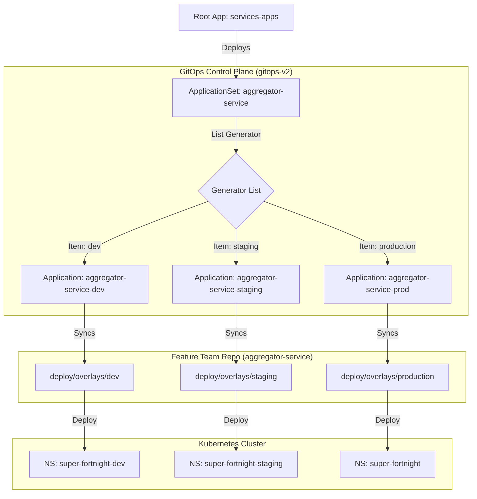

# GitOps v2 Repository

This repository hosts the **ArgoCD Application definitions** that drive the Super Fortnight platform. It serves as the "control plane" for our GitOps workflow.

## Repository Structure

```
gitops-v2/
├── argocd/
│   └── apps/
│       ├── services-apps.yaml      # Root App-of-Apps
│       └── aggregator-appset.yaml  # ApplicationSet for Aggregator Service
```

## The ApplicationSet Pattern

We use **ArgoCD ApplicationSets** to dynamically manage potential environments for a service. This eliminates the need for manual file duplication.

### Flow Diagram




### Control Plane: `aggregator-appset.yaml`

This file is the "Switchboard". It defines which environments are active using a simple list.

```yaml
spec:
  generators:
    - list:
        elements:
          - env: dev
            namespace: super-fortnight-dev
          - env: staging
            namespace: super-fortnight-staging
          - env: production
            namespace: super-fortnight
```

### How to Manage Environments

**To add an environment:**
Simply add a new item to the list:

```yaml
- env: qa
  namespace: super-fortnight-qa
```

**To remove an environment (undeploy):**
Simply remove the item from the list. ArgoCD will automatically prune the associated Application and all its resources.

### Benefits

- **Configuration, not Code**: Enabling/disabling environments is just data.
- **Dynamic**: No need to create new files for new environments.
- **Self-Service**: Feature teams just need to ensure `deploy/overlays/<env>` exists in their repo.

## Feature Team Workflow

Feature teams don't typically touch this repository. They work in their own service repositories (e.g., `aggregator-service`). This repository is maintained by the **Platform Team** to define _where_ and _how_ services are deployed.

## Adding a New Service

1. Create `argocd/apps/<new-service>-appset.yaml`.
2. Copy the content from `aggregator-appset.yaml`.
3. Update `metadata.name` and `repoURL`.
4. Define the active environments in the `list` generator.

## Related Documentation

For comprehensive documentation on the platform architecture and workflows, see the centralized documentation in **gitops-v3/docs/**:

- [ApplicationSet Pattern Architecture](../gitops-v3/docs/architecture/applicationset-pattern.md)
- [Cloud-Native Workflow](../gitops-v3/docs/architecture/cloud-native-workflow.md)
- [Platform Team Guide](../gitops-v3/docs/guides/platform-team-guide.md)
