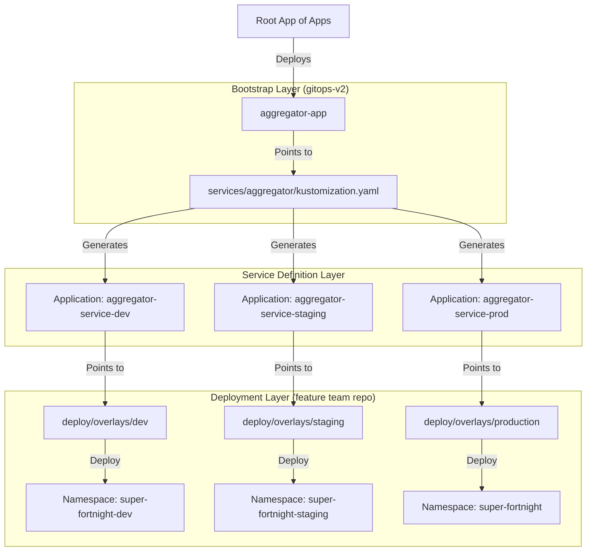

# GitOps v2 Repository

This repository hosts the **ArgoCD Application definitions** that drive the Super Fortnight platform. It serves as the "control plane" for our GitOps workflow.

## Repository Structure

```
gitops-v2/
├── argocd/
│   └── apps/
│       ├── services-apps.yaml    # Root App-of-Apps (The Big Bang)
│       └── aggregator-app.yaml   # Bootstrap app for Aggregator Service
├── services/
│   └── aggregator/               # Kustomize definitions for Aggregator Service
│       ├── base/
│       │   ├── application.yaml  # Base Application template
│       │   └── kustomization.yaml
│       ├── overlays/
│       │   ├── dev/              # Dev Environment Definition
│       │   ├── staging/          # Staging Environment Definition
│       │   └── prod/             # Production Environment Definition
│       └── kustomization.yaml    # Root "Switchboard" for this service
```

## The "App of Apps" Cascading Flow

We use a cascading "App of Apps" pattern to enable single-click deployment of entire service ecosystems.

### Flow Diagram




### 1. Bootstrap Layer (`argocd/apps/`)

The `aggregator-app.yaml` is the entry point. It points to `services/aggregator/`.

### 2. Service Definition Layer (`services/aggregator/`)

This directory contains a **Kustomize** build that generates the actual ArgoCD `Application` resources.

- **`base/application.yaml`**: The template for the ArgoCD Application.
- **`overlays/`**: Environment-specific patches (target namespace, repo path, etc.).
- **`kustomization.yaml`**: The **Switchboard**.

### 3. The Switchboard

The root `services/aggregator/kustomization.yaml` controls which environments are active.

**To enable all environments:**

```yaml
resources:
  - overlays/dev
  - overlays/staging
  - overlays/prod
```

**To disable Production (e.g., during maintenance or initial rollout):**

```yaml
resources:
  - overlays/dev
  - overlays/staging
  # - overlays/prod  <-- Just comment it out!
```

ArgoCD will automatically prune the Application resources for commented-out environments.

## Feature Team Workflow

Feature teams don't typically touch this repository. They work in their own service repositories (e.g., `aggregator-service`). This repository is maintained by the **Platform Team** to define _where_ and _how_ services are deployed.

## Adding a New Service

1. Create directory `services/<new-service>`.
2. Copy the structure from `services/aggregator/`.
3. Update `base/application.yaml` with the new service's Git URL.
4. Update `overlays/` with correct namespaces and paths.
5. Create a bootstrap app in `argocd/apps/<new-service>-app.yaml`.
