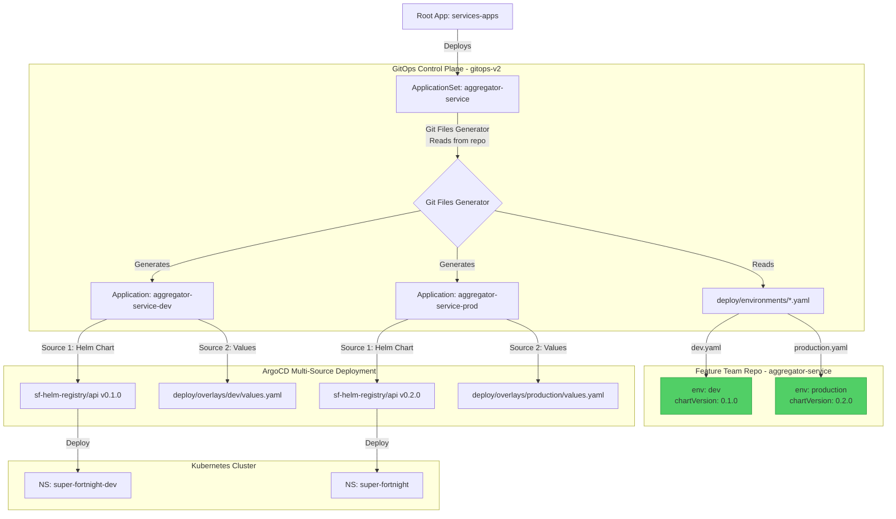

# GitOps v2 Repository

This repository hosts the **ArgoCD Application definitions** that drive the Super Fortnight platform. It serves as the "control plane" for our GitOps workflow.

## Repository Structure

```
gitops-v2/
├── argocd/
│   └── apps/
│       ├── services-apps.yaml      # Root App-of-Apps
│       └── aggregator-appset.yaml  # ApplicationSet for Aggregator Service
```

## The ApplicationSet Pattern

We use **ArgoCD ApplicationSets** to dynamically manage potential environments for a service. This eliminates the need for manual file duplication.

### Flow Diagram




### Control Plane: `aggregator-appset.yaml`

This ApplicationSet uses the **Git Files Generator** to read environment configurations from the feature team's repository. This gives teams full control over:

- Which environments exist
- Which chart version each environment uses
- Environment-specific configuration

```yaml
spec:
  generators:
    - git:
        repoURL: https://github.com/ashutosh-18k92/aggregator-service.git
        files:
          - path: "deploy/environments/*.yaml"
```

Each environment is defined in a YAML file in the feature team's repo:

**`deploy/environments/dev.yaml`**:

```yaml
env: dev
namespace: super-fortnight-dev
chartRepo: https://github.com/ashutosh-18k92/sf-helm-registry.git
chartVersion: "0.1.0" # Team controls this!
chartPath: api
```

### How to Manage Environments

**Feature teams control environments** by adding/removing files in their own repository.

**To add an environment:**
Create a new environment file in the feature team repo:

```bash
cd aggregator-service
cat > deploy/environments/qa.yaml <<EOF
env: qa
namespace: super-fortnight-qa
chartRepo: https://github.com/ashutosh-18k92/sf-helm-registry.git
chartVersion: "0.1.0"
chartPath: api
EOF

git add deploy/environments/qa.yaml
git commit -m "Add QA environment"
git push
```

ArgoCD automatically creates `aggregator-service-qa` Application!

**To remove an environment (undeploy):**
Delete the environment file:

```bash
git rm deploy/environments/qa.yaml
git commit -m "Remove QA environment"
git push
```

ArgoCD automatically prunes the Application and all its resources.

**To upgrade chart version:**
Edit the environment file:

```bash
vim deploy/environments/production.yaml
# Change chartVersion: "0.1.0" → "0.2.0"
git commit -m "Upgrade production to chart v0.2.0"
git push
```

### Benefits

- **Team Autonomy**: Feature teams control chart versions and environments
- **Git-Based**: All configuration in version control (feature team repo)
- **Self-Service**: No platform team involvement for environment changes
- **Helm 4.x Compatible**: Uses ArgoCD multi-source, not Kustomize helmCharts
- **Gradual Rollout**: Test new chart versions in dev before production

## Feature Team Workflow

Feature teams have **full control** over their service deployments:

- **Environments**: Managed in `deploy/environments/*.yaml` in their repo
- **Chart Versions**: Specified per-environment in environment files
- **Configuration**: Helm values in `deploy/base/` and `deploy/overlays/`

The platform team maintains the ApplicationSet definitions in this repository, but teams control what gets deployed.

## Adding a New Service

1. Create `argocd/apps/<new-service>-appset.yaml`.
2. Copy the content from `aggregator-appset.yaml`.
3. Update `metadata.name` and `repoURL`.
4. Define the active environments in the `list` generator.

## Related Documentation

For comprehensive documentation on the platform architecture and workflows, see the centralized documentation in **gitops-v3/docs/**:

- [ApplicationSet Pattern Architecture](../gitops-v3/docs/architecture/applicationset-pattern.md)
- [Cloud-Native Workflow](../gitops-v3/docs/architecture/cloud-native-workflow.md)
- [Platform Team Guide](../gitops-v3/docs/guides/platform-team-guide.md)
