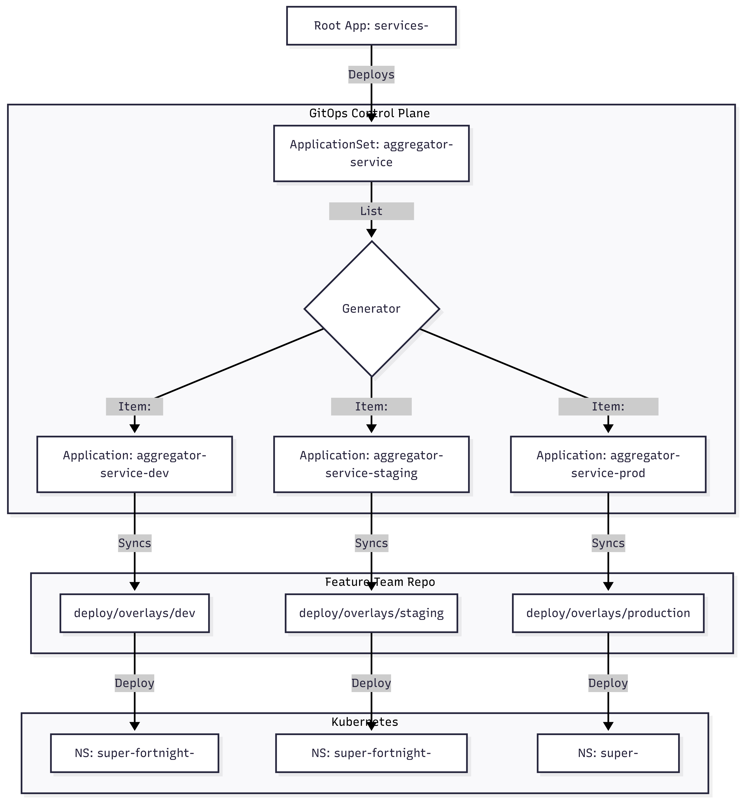
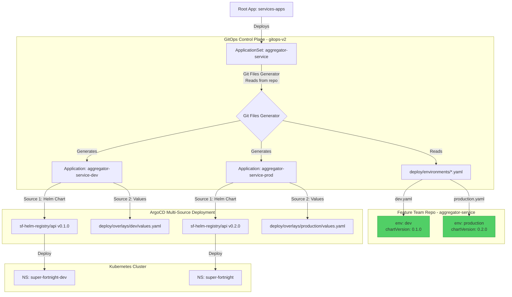

# GitOps v2 Repository

This repository hosts the **ArgoCD Application definitions** that drive the Super Fortnight platform. It serves as the "control plane" for our GitOps workflow.

## Setting up argocd

Using Helm: https://artifacthub.io/packages/helm/argo/argo-cd

Install Instructions:
Add repo: `helm repo add argo https://argoproj.github.io/argo-helm`
Install Chart: `helm install my-argo-cd argo/argo-cd --version 9.4.1`

Configure the `--enable-helm` flag for Kustomize
refer [Enable Helm](./argocd/config/ENABLE_KUSTOMIZE_HELM.md)

## Setting up ArgoCD Deployment Server

### Prerequisites

- Kubernetes cluster (v1.24+)
- `kubectl` configured to access your cluster
- `helm` CLI installed (v3.0+)

### Installation

ArgoCD can be installed using the official Helm chart from [Artifact Hub](https://artifacthub.io/packages/helm/argo/argo-cd).

**Step 1: Add the ArgoCD Helm repository**

```bash
helm repo add argo https://argoproj.github.io/argo-helm
helm repo update
```

**Step 2: Install ArgoCD**

```bash
# Install ArgoCD in the argocd namespace
helm install argocd argo/argo-cd \
  --version 9.4.1 \
  --namespace argocd \
  --create-namespace
```

**Step 3: Wait for ArgoCD to be ready**

```bash
# Wait for all ArgoCD components to be ready
kubectl wait --for=condition=available --timeout=300s \
  deployment/argocd-server \
  deployment/argocd-repo-server \
  deployment/argocd-application-controller \
  -n argocd
```

### Configuration: Enable Kustomize Helm Support

ArgoCD requires the `--enable-helm` flag to be configured globally to support Helm charts in Kustomize builds.

**Step 1: Apply the ConfigMap patch**

```bash
kubectl apply -f argocd/config/argocd-cm-kustomize-helm.yaml
```

Or manually patch the ConfigMap:

```bash
kubectl patch configmap argocd-cm -n argocd --type merge -p '{
  "data": {
    "kustomize.buildOptions": "--enable-helm --load-restrictor LoadRestrictionsNone"
  }
}'
```

**Step 2: Restart the ArgoCD repo server**

```bash
# Restart to apply the configuration
kubectl rollout restart deployment argocd-repo-server -n argocd

# Wait for the rollout to complete
kubectl rollout status deployment argocd-repo-server -n argocd
```

**Step 3: Verify the configuration**

```bash
# Check that the ConfigMap has the correct setting
kubectl get configmap argocd-cm -n argocd -o yaml | grep kustomize.buildOptions

# Expected output:
# kustomize.buildOptions: --enable-helm --load-restrictor LoadRestrictionsNone
```

For detailed troubleshooting and alternative approaches, see [Enable Kustomize Helm Support](./argocd/config/ENABLE_KUSTOMIZE_HELM.md).

### Accessing ArgoCD UI

**Step 1: Get the admin password**

```bash
# Retrieve the initial admin password
kubectl get secret argocd-initial-admin-secret -n argocd \
  -o jsonpath="{.data.password}" | base64 -d
```

**Step 2: Port-forward to access the UI**

```bash
# Forward port 8080 to the ArgoCD server
kubectl port-forward svc/argocd-server -n argocd 8080:443
```

**Step 3: Login**

- Open browser to `https://localhost:8080`
- Username: `admin`
- Password: (from Step 1)

### Installing the ArgoCD CLI (Optional)

```bash
# Download and install argocd CLI
curl -sSL -o argocd https://github.com/argoproj/argo-cd/releases/latest/download/argocd-linux-amd64
chmod +x argocd
sudo mv argocd /usr/local/bin/

# Login via CLI
argocd login localhost:8080 --username admin --password <password> --insecure
```

### Verification

After installation and configuration, verify that ArgoCD is working correctly:

```bash
# Check all ArgoCD pods are running
kubectl get pods -n argocd

# Apply a test ApplicationSet
kubectl apply -f argocd/apps/aggregator-appset.yaml

# List applications
kubectl get applications -n argocd
# or via CLI
argocd app list

# View application details
argocd app get aggregator-service-development
```

## Repository Structure

```
gitops-v2/
├── argocd/
│   ├── apps/
│   │   ├── services-apps.yaml      # Root App-of-Apps
│   │   └── aggregator-appset.yaml  # ApplicationSet for Aggregator Service
│   └── config/
│       └── argocd-cm-kustomize-helm.yaml  # Kustomize Helm support config
```

## The ApplicationSet Pattern

We use **ArgoCD ApplicationSets** to dynamically manage potential environments for a service. This eliminates the need for manual file duplication.

### Flow Diagram





### Control Plane: `aggregator-appset.yaml`

This ApplicationSet uses the **Git Files Generator** to read environment configurations from the feature team's repository. This gives teams full control over:

- Which environments exist
- Which chart version each environment uses
- Environment-specific configuration

```yaml
spec:
  generators:
    - git:
        repoURL: https://github.com/ashutosh-18k92/aggregator-service.git
        files:
          - path: "deploy/environments/*.yaml"
```

Each environment is defined in a YAML file in the feature team's repo:

**`deploy/environments/dev.yaml`**:

```yaml
env: dev
namespace: super-fortnight-dev
chartRepo: https://github.com/ashutosh-18k92/sf-helm-registry.git
chartVersion: "0.1.0" # Team controls this!
chartPath: api
```

### How to Manage Environments

**Feature teams control environments** by adding/removing files in their own repository.

**To add an environment:**
Create a new environment file in the feature team repo:

```bash
cd aggregator-service
cat > deploy/environments/qa.yaml <<EOF
env: qa
namespace: super-fortnight-qa
chartRepo: https://github.com/ashutosh-18k92/sf-helm-registry.git
chartVersion: "0.1.0"
chartPath: api
EOF

git add deploy/environments/qa.yaml
git commit -m "Add QA environment"
git push
```

ArgoCD automatically creates `aggregator-service-qa` Application!

**To remove an environment (undeploy):**
Delete the environment file:

```bash
git rm deploy/environments/qa.yaml
git commit -m "Remove QA environment"
git push
```

ArgoCD automatically prunes the Application and all its resources.

**To upgrade chart version:**
Edit the environment file:

```bash
vim deploy/environments/production.yaml
# Change chartVersion: "0.1.0" → "0.2.0"
git commit -m "Upgrade production to chart v0.2.0"
git push
```

### Benefits

- **Team Autonomy**: Feature teams control chart versions and environments
- **Git-Based**: All configuration in version control (feature team repo)
- **Self-Service**: No platform team involvement for environment changes
- **Helm 4.x Compatible**: Uses ArgoCD multi-source, not Kustomize helmCharts
- **Gradual Rollout**: Test new chart versions in dev before production

## Feature Team Workflow

Feature teams have **full control** over their service deployments:

- **Environments**: Managed in `deploy/environments/*.yaml` in their repo
- **Chart Versions**: Specified per-environment in environment files
- **Configuration**: Helm values in `deploy/base/` and `deploy/overlays/`

The platform team maintains the ApplicationSet definitions in this repository, but teams control what gets deployed.

## Adding a New Service

1. Create `argocd/apps/<new-service>-appset.yaml`.
2. Copy the content from `aggregator-appset.yaml`.
3. Update `metadata.name` and `repoURL`.
4. Define the active environments in the `list` generator.

## Related Documentation

For comprehensive documentation on the platform architecture and workflows, see the centralized documentation in **gitops-v3/docs/**:

- [ApplicationSet Pattern Architecture](../gitops-v3/docs/architecture/applicationset-pattern.md)
- [Cloud-Native Workflow](../gitops-v3/docs/architecture/cloud-native-workflow.md)
- [Platform Team Guide](../gitops-v3/docs/guides/platform-team-guide.md)
